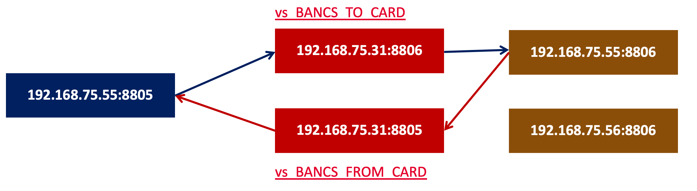
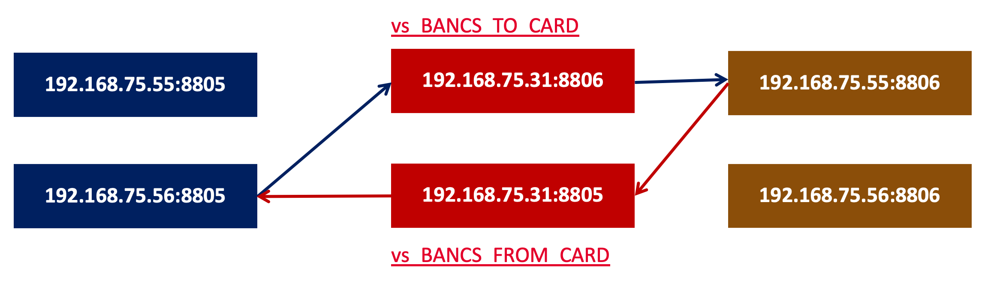

= MRF Generic Message Routing Example 
:toc: manual

== Minimum Generic Message Routing

One BANCS and two CARD, the `test message` be transit via Bi-Directional connection, the iRules are as simple as possible.

=== BIG-IP Configuration Setting Up

[source, bash]
----
tmsh create ltm profile tcp tcp3000 idle-timeout 3000
tmsh create ltm message-routing generic protocol protocol_BANCS_CARD { app-service none disable-parser yes }
tmsh create ltm message-routing generic transport-config tc_BANCS_TO_CARD { profiles add { tcp3000  protocol_BANCS_CARD  } rules { IRULES_BANCS_TO_CARD } }
tmsh create ltm message-routing generic transport-config tc_BANCS_FROM_CARD { profiles add { tcp3000  protocol_BANCS_CARD  } rules { IRULES_BANCS_FROM_CARD } }
tmsh create ltm pool pool_BANCS_TO_CARD members add { 192.168.75.55:8806 192.168.75.56:8806} monitor tcp_half_open
tmsh create ltm pool pool_BANCS_FROM_CARD members add { 192.168.75.55:8805 } monitor tcp_half_open
tmsh create ltm message-routing generic peer peer_BANCS_TO_CARD { pool pool_BANCS_TO_CARD transport-config tc_BANCS_TO_CARD }
tmsh create ltm message-routing generic peer peer_BANCS_FROM_CARD { pool pool_BANCS_FROM_CARD transport-config tc_BANCS_FROM_CARD }
tmsh create ltm message-routing generic route route_BANCS_TO_CARD { destination-address my_dest peers { peer_BANCS_TO_CARD } }
tmsh create ltm message-routing generic route route_BANCS_FROM_CARD { destination-address my_dest peers { peer_BANCS_FROM_CARD } }
tmsh create ltm message-routing generic router router_BANCS_TO_CARD { app-service none routes add { route_BANCS_TO_CARD } }
tmsh create ltm message-routing generic router router_BANCS_FROM_CARD { app-service none routes add { route_BANCS_FROM_CARD } }
tmsh create ltm virtual vs_BANCS_TO_CARD { destination 192.168.75.31:8806 ip-protocol tcp pool pool_BANCS_TO_CARD profiles add { protocol_BANCS_CARD router_BANCS_TO_CARD tcp3000 } rules { IRULES_BANCS_TO_CARD } source-address-translation { type automap } }
tmsh create ltm virtual vs_BANCS_FROM_CARD { destination 192.168.75.31:8805 ip-protocol tcp pool pool_BANCS_FROM_CARD profiles add { protocol_BANCS_CARD router_BANCS_FROM_CARD tcp3000 } rules { IRULES_BANCS_FROM_CARD } source-address-translation { type automap } }
----

* link:files/min/IRULES_BANCS_TO_CARD[IRULES_BANCS_TO_CARD]
* link:files/min/IRULES_BANCS_FROM_CARD[IRULES_BANCS_FROM_CARD]

=== BIG-IP Configuration Clean Up

[source, bash]
----
tmsh delete ltm virtual vs_BANCS_TO_CARD
tmsh delete ltm virtual vs_BANCS_FROM_CARD
tmsh delete ltm message-routing generic router router_BANCS_TO_CARD
tmsh delete ltm message-routing generic router router_BANCS_FROM_CARD
tmsh delete ltm message-routing generic route route_BANCS_TO_CARD
tmsh delete ltm message-routing generic route route_BANCS_FROM_CARD
tmsh delete ltm message-routing generic peer peer_BANCS_TO_CARD
tmsh delete ltm message-routing generic peer peer_BANCS_FROM_CARD
tmsh delete ltm pool pool_BANCS_TO_CARD
tmsh delete ltm pool pool_BANCS_FROM_CARD
tmsh delete ltm message-routing generic transport-config tc_BANCS_TO_CARD
tmsh delete ltm message-routing generic transport-config tc_BANCS_FROM_CARD
tmsh delete ltm message-routing generic protocol protocol_BANCS_CARD
tmsh delete ltm profile tcp tcp3000
----

=== TEST

[source, bash]
.*1. Start BANCS*
----
bancs -b -l 1 192.168.75.31
----

[source, bash]
.*2. START CARD*
----
bancs -c -l 1 192.168.75.31
bancs -c -l 1 192.168.75.31
----

[source, bash]
.*3. Generate test message*
----
bancs -t -k 9 -n 10 > /etc/bancs.data
----

[source, bash]
.*4. Send test message*
----
bancs -e -l 1 192.168.75.55
----

[source, bash]
.*5. Check CARD log(message be distributed to 2 host)*
----
@1 ~]# bancs -c -l 1 192.168.75.31
16-Oct-2022 20:09:18 (1883) CARD: start
16-Oct-2022 20:09:18 (1884) CARD: bancs handler listen on 0.0.0.0:8806
16-Oct-2022 20:09:28 (1883) CARD: connect to bancs 192.168.75.31
16-Oct-2022 20:10:32 (1884) CARD: connection from 192.168.75.50:54248
16-Oct-2022 20:10:32 (1884) CARD: receive message from 192.168.75.50:54248, message length: 14, total length: 19
16-Oct-2022 20:10:32 (1883) CARD: response message to bancs, message: 00014test message 1
16-Oct-2022 20:10:34 (1884) CARD: receive message from 192.168.75.50:54248, message length: 14, total length: 19
16-Oct-2022 20:10:34 (1883) CARD: response message to bancs, message: 00014test message 3
16-Oct-2022 20:10:36 (1884) CARD: receive message from 192.168.75.50:54248, message length: 14, total length: 19
16-Oct-2022 20:10:36 (1883) CARD: response message to bancs, message: 00014test message 5
16-Oct-2022 20:10:38 (1884) CARD: receive message from 192.168.75.50:54248, message length: 14, total length: 19
16-Oct-2022 20:10:38 (1883) CARD: response message to bancs, message: 00014test message 7
16-Oct-2022 20:10:40 (1884) CARD: receive message from 192.168.75.50:54248, message length: 14, total length: 19
16-Oct-2022 20:10:40 (1883) CARD: response message to bancs, message: 00014test message 9

@2 ~]# bancs -c -l 1 192.168.75.31
16-Oct-2022 20:09:11 (1661) CARD: start
16-Oct-2022 20:09:11 (1662) CARD: bancs handler listen on 0.0.0.0:8806
16-Oct-2022 20:09:21 (1661) CARD: connect to bancs 192.168.75.31
16-Oct-2022 20:10:31 (1662) CARD: connection from 192.168.75.50:54247
16-Oct-2022 20:10:31 (1662) CARD: receive message from 192.168.75.50:54247, message length: 14, total length: 19
16-Oct-2022 20:10:31 (1661) CARD: response message to bancs, message: 00014test message 0
16-Oct-2022 20:10:33 (1662) CARD: receive message from 192.168.75.50:54247, message length: 14, total length: 19
16-Oct-2022 20:10:33 (1661) CARD: response message to bancs, message: 00014test message 2
16-Oct-2022 20:10:35 (1662) CARD: receive message from 192.168.75.50:54247, message length: 14, total length: 19
16-Oct-2022 20:10:35 (1661) CARD: response message to bancs, message: 00014test message 4
16-Oct-2022 20:10:37 (1662) CARD: receive message from 192.168.75.50:54247, message length: 14, total length: 19
16-Oct-2022 20:10:37 (1661) CARD: response message to bancs, message: 00014test message 6
16-Oct-2022 20:10:39 (1662) CARD: receive message from 192.168.75.50:54247, message length: 14, total length: 19
16-Oct-2022 20:10:39 (1661) CARD: response message to bancs, message: 00014test message 8
----

== Bi-Directional Persistence & Connection Auto-Initialization

There are 2 BANCS and 2 CARD, ESB to send message to `192.168.75.56:8805` and start the transaction:

1. `192.168.75.56:8805` sent message to `192.168.75.31:8806`
2. `192.168.75.31:8806` sent message to either `192.168.75.55:8806`, or `192.168.75.56:8806`(assume `192.168.75.55:8806` be selected)
3. `192.168.75.55:8806` response message to `192.168.75.31:8805`
4. `192.168.75.31:8805` response message to `192.168.75.56:8805` due to Bi-Directional Persistence

=== BIG-IP Configuration Setting Up

[source, bash]
----
tmsh create ltm profile tcp tcp3000 idle-timeout 3000
tmsh create ltm message-routing generic protocol protocol_BANCS_CARD { app-service none disable-parser yes }
tmsh create ltm message-routing generic transport-config tc_BANCS_TO_CARD { profiles add { tcp3000  protocol_BANCS_CARD  } rules { IRULES_BANCS_TO_CARD } }
tmsh create ltm message-routing generic transport-config tc_BANCS_FROM_CARD { profiles add { tcp3000  protocol_BANCS_CARD  } rules { IRULES_BANCS_FROM_CARD } }
tmsh create ltm pool pool_BANCS_TO_CARD members add { 192.168.75.55:8806 192.168.75.56:8806} monitor tcp_half_open
tmsh create ltm pool pool_BANCS_FROM_CARD members add { 192.168.75.55:8805 192.168.75.56:8805 } monitor tcp_half_open 
tmsh create ltm message-routing generic peer peer_BANCS_TO_CARD { pool pool_BANCS_TO_CARD transport-config tc_BANCS_TO_CARD }
tmsh create ltm message-routing generic peer peer_BANCS_FROM_CARD { pool pool_BANCS_FROM_CARD transport-config tc_BANCS_FROM_CARD auto-initialization enabled }
tmsh create ltm message-routing generic route route_BANCS_TO_CARD { destination-address my_dest peers { peer_BANCS_TO_CARD } }
tmsh create ltm message-routing generic route route_BANCS_FROM_CARD { destination-address my_dest peers { peer_BANCS_FROM_CARD } }
tmsh create ltm message-routing generic router router_BANCS_TO_CARD { app-service none routes add { route_BANCS_TO_CARD } }
tmsh create ltm message-routing generic router router_BANCS_FROM_CARD { app-service none routes add { route_BANCS_FROM_CARD } }
tmsh create ltm virtual vs_BANCS_TO_CARD { destination 192.168.75.31:8806 ip-protocol tcp pool pool_BANCS_TO_CARD profiles add { protocol_BANCS_CARD router_BANCS_TO_CARD tcp3000 } rules { IRULES_BANCS_TO_CARD } source-address-translation { type automap } }
tmsh create ltm virtual vs_BANCS_FROM_CARD { destination 192.168.75.31:8805 ip-protocol tcp pool pool_BANCS_FROM_CARD profiles add { protocol_BANCS_CARD router_BANCS_FROM_CARD tcp3000 } rules { IRULES_BANCS_FROM_CARD } source-address-translation { type automap } }
----

* link:files/IRULES_BANCS_TO_CARD[IRULES_BANCS_TO_CARD]
* link:files/IRULES_BANCS_FROM_CARD[IRULES_BANCS_FROM_CARD]

=== BIG-IP Configuration Clean Up

[source, bash]
----
tmsh delete ltm virtual vs_BANCS_TO_CARD
tmsh delete ltm virtual vs_BANCS_FROM_CARD
tmsh delete ltm message-routing generic router router_BANCS_TO_CARD
tmsh delete ltm message-routing generic router router_BANCS_FROM_CARD
tmsh delete ltm message-routing generic route route_BANCS_TO_CARD
tmsh delete ltm message-routing generic route route_BANCS_FROM_CARD
tmsh delete ltm message-routing generic peer peer_BANCS_TO_CARD
tmsh delete ltm message-routing generic peer peer_BANCS_FROM_CARD
tmsh delete ltm pool pool_BANCS_TO_CARD
tmsh delete ltm pool pool_BANCS_FROM_CARD
tmsh delete ltm message-routing generic transport-config tc_BANCS_TO_CARD
tmsh delete ltm message-routing generic transport-config tc_BANCS_FROM_CARD
tmsh delete ltm message-routing generic protocol protocol_BANCS_CARD
tmsh delete ltm profile tcp tcp3000
----

=== TEST

[source, bash]
.*1. Start BANCS*
----
bancs -b 192.168.75.31
bancs -b 192.168.75.31
----

[source, bash]
.*2. START CARD*
----
bancs -c 192.168.75.31
bancs -c 192.168.75.31
----

[source, bash]
.*3. Generate test message*
----
bancs -t -n 3 > /etc/bancs.data
----

[source, bash]
.*4. Send test message*
----
bancs -e 192.168.75.56
----

=== TEST

[source, bash]
.*1. Start BANCS*
----

----

[source, bash]
.*2. START CARD*
----

----

[source, bash]
.*3. Generate test message*
----

----

[source, bash]
.*4. Send test message*
----

----

