= User Guide
:toc: manual

== Installation

Install on Red Hat Linux via:

----
rpm -ivh ttcp-1.12-1.x86_64.rpm 
----

== Run

=== ttcp

[source, bash]
.*Run as Receiver*
----
ttcp -r -s -4 -v -p 5050
----

[source, bash]
.*Run as Transfer*
----
ttcp -t -s -n 10240 -v -4 -p 5050 10.1.20.203
----

[source, bash]
.*Collect Results*
----
ttcp-r: 83886080 bytes in 1.34 real seconds = 61108.02 KB/sec +++
ttcp-r: 83886080 bytes in 0.10 CPU seconds = 827040.34 KB/cpu sec
ttcp-r: 10341 I/O calls, msec/call = 0.13, calls/sec = 7713.84
ttcp-r: 0.0user 0.0sys 0:01real 6% 0i+0d 330maxrss 0+2pf 368+0csw

ttcp-t: 83886080 bytes in 1.29 real seconds = 63287.18 KB/sec +++
ttcp-t: 83886080 bytes in 0.03 CPU seconds = 2522633.49 KB/cpu sec
ttcp-t: 10240 I/O calls, msec/call = 0.13, calls/sec = 7910.90
ttcp-t: 0.0user 0.0sys 0:01real 1% 0i+0d 362maxrss 0+2pf 122+0csw
----

=== echoS

[source, bash]
.*Run as Server*
----
# echoS -s -p 12302 -4
----

[source, bash]
.*Run as Client*
----
# echoS -c -p 12302 -P 23401 10.1.20.203
1649260296 1962 echoS: socket
1649260296 1962 echoS: bind
1649260296 1962 echoS: connect
time
1649260300
daytime
Wed Apr  6 23:51:44 2022
chargen
u$a71i0Rkk*1LkQ46d2Dqtau4Pn1cU;tZ8G'#Xsn_};-&)\<
----

=== chat

[source, bash]
.*Run as Server*
----
# chat -s -p 12303 -4
chat-s: socket
chat-s: bind
chat-s: accept from 10.1.20.201
10.1.20.201: hi
chat-s: yes
----

[source, bash]
.*Run as Client*
----
# chat -c -p 12303 -P 23401 10.1.20.203
chat-c: socket
chat-c: bind
chat-c: connect
chat-c: hi
10.1.20.203: yes
----

== Prerequisites

=== Lab Topologies

As showing in figure, there are 4 hosts, `lb-1`, `lb-2`, `app-1`, `app-2`, as per host name suggestions, 2 hosts for proxy/loadbalancer, 2 hosts for apps. The hosts for proxy/loadbalancer has 2 NICs, ens33 for public access, and ens34 for NAT or internal route usage. `lb-1` and `lb-2` are in 10.1.10.0/24 network, all hosts are in 10.1.20.0/24 network.

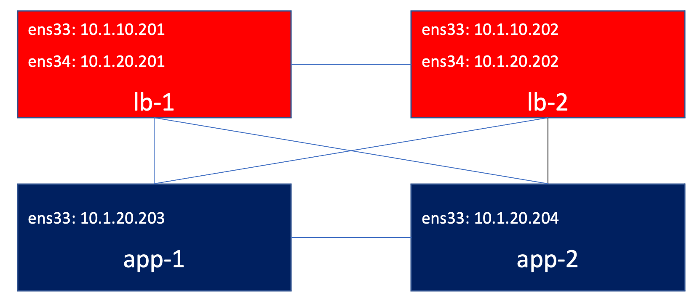

=== Linux Kernel Networking Stack 

There are seven logical networking layers according to the Open Systems Interconnection (OSI) model. The lowest layer is the physical layer, which is the hardware, and the highest layer is the application layer, where userspace software processes are running. These seven layers are:

1. `The physical layer:` Handles electrical signals and the low level details.
2. `The data link layer:` Handles data transfer between endpoints. The most common data link layer is Ethernet. The Linux Ethernet *network device drivers* reside in this layer.
3. `The network layer:` Handles packet forwarding and host addressing. The most common network layers of the Linux Kernel Networking subsystem: *IPv4* or *IPv6*.
4. `The transport layer:` Handles data sending between nodes. The *TCP* and *UDP* protocols are the best-known protocols.
5. `The session layer:` Handles sessions between endpoints.
6. `The presentation layer:` Handles delivery and formatting.
7. `The application layer:` Provides network services to end-user applications.

Linux Kernel Networking stack handles 3 layers, the L2, L3 and L4, correspond to the data link layer, the network layer, and the transport layer in the seven-layer model. The essence of the Linux kernel stack is passing incoming packets from L2 (the network device drivers) to L3 (the network layer, usually IPv4 or IPv6) and then to L4 (the transport layer, where you have, for example, TCP or UDP listening sockets) if they are for local delivery, or back to L2 for transmission when the packets should be forwarded. Outgoing packets that were locally generated are passed from L4 to L3 and then to L2 for actual transmission by the network device driver. 

The kernel does not handle any layer above L4; those layers (the session, presentation, and application layers) are handled solely by userspace applications. The physical layer (L1) is also not handled by the Linux kernel.

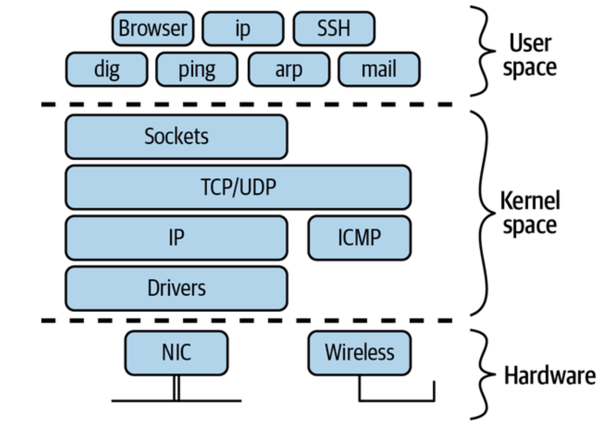

== Three-Way Handshaking

If a server _(eg, user space app on host `app-2`)_ request a *passive open* _(call sockets api tell TCP that it's ready to accept connection)_,

[source, bash]
----
ttcp -r 
----

a client _(on host `app-1` request)_ a *active open* _(call sockets api tell TCP that it needs to be connected to that particular server)_,

[source, bash]
----
ttcp -t app-2
----

then TCP start Three-Way Handshaking:

1. client send SYN to server
2. server received client's SYN, send SYN + ACK to client
3. client received server's SYN + ACK , send ACK to server

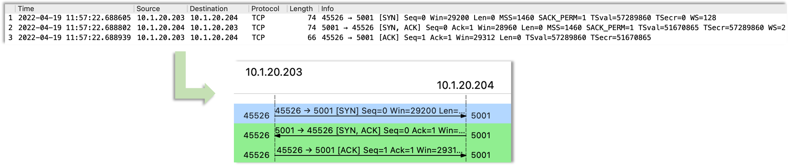

=== How many times SYN Retransmission?

If set a policy on host `app-2` to DROP any packet if destination port is `5001`,

[source, bash]
----
iptables -I INPUT -p tcp --dport 5001 -j DROP
----

then client try to connection to server, Three-Way Handshaking will blocked on SYN sending, and end with `110 Connection timed out` error after 6 times Retransmission.

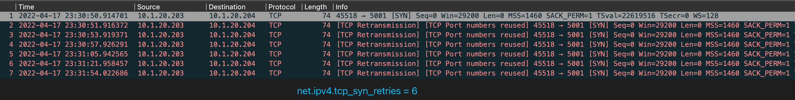

If look into above diagram, there are 7 SYN packets, 6 SYN are Retransmission packet, if look into the timestamp of each packet:

|===
|SYN Times |Timestamp |Time Interval comapre last SYN Times(seconds) 

|1
|12:13:01.849323
|

|2
|12:13:02.853415
|1

|3
|12:13:04.860668
|2

|4
|12:13:08.869242
|4

|5
|12:13:16.900881
|8

|6
|12:13:32.932824
|16

|7
|12:14:04.996790
|32

|===

Note that the time interval between 2 retransmissions are in *Exponential backoff*, this due the the spec definition.

There are 6 times retries that because Linux default tcp_syn_retries is 6,

[source, bash]
.*net.ipv4.tcp_syn_retries*
----
# sysctl net.ipv4.tcp_syn_retries
net.ipv4.tcp_syn_retries = 6
----

=== How many times SYN + ACK Retransmission?

If set a policy on host `app-1` to DROP any packet if destination port is `20001`,

[source, bash]
----
iptables -I INPUT -p tcp --dport 20001 -j DROP
----

while trans connect to recv append a `-P 20001`, to make SYN + ACK's destination port is 20001, and hint policy set above.

[source, bash]
----
ttcp -t -P 20001 app-2
----  

The connection also end with `110 Connection timed out` error after 6 times Retransmission, but the differenc is the server also send the SYN + ACK Retransmission.

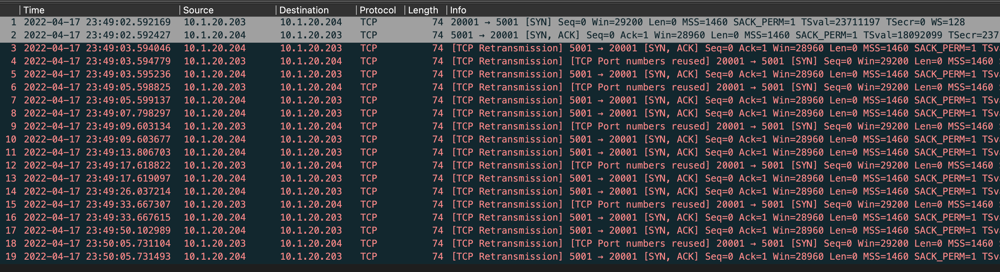

To further investigate what caused the `110 Connection timed out` error, use the `tcp.flags.syn == 1 and tcp.flags.ack == 0` to filter only *SYN* packet:

|===
|No |SYN Times |Timestamp |Time Interval comapre last SYN Times(seconds)

|1
|1
|23:49:02.592
|

|4
|2
|23:49:03.595
|1

|6
|3
|23:49:05.599
|2

|9
|4
|23:49:09.603
|4

|12
|5
|23:49:17.619
|8

|15
|6
|23:49:33.619
|16

|18
|7
|23:50:05.731
|32

|===   

It's obvious that the `net.ipv4.tcp_syn_retries = 6` seeting on host `app-1` matters, `110 Connection timed out` error generated after 6 times of SYN Retransmission, *Exponential backoff* formular also be applied, the Time Interval comapre last SYN Times are 1, 2, 4, 8, 16, 32.

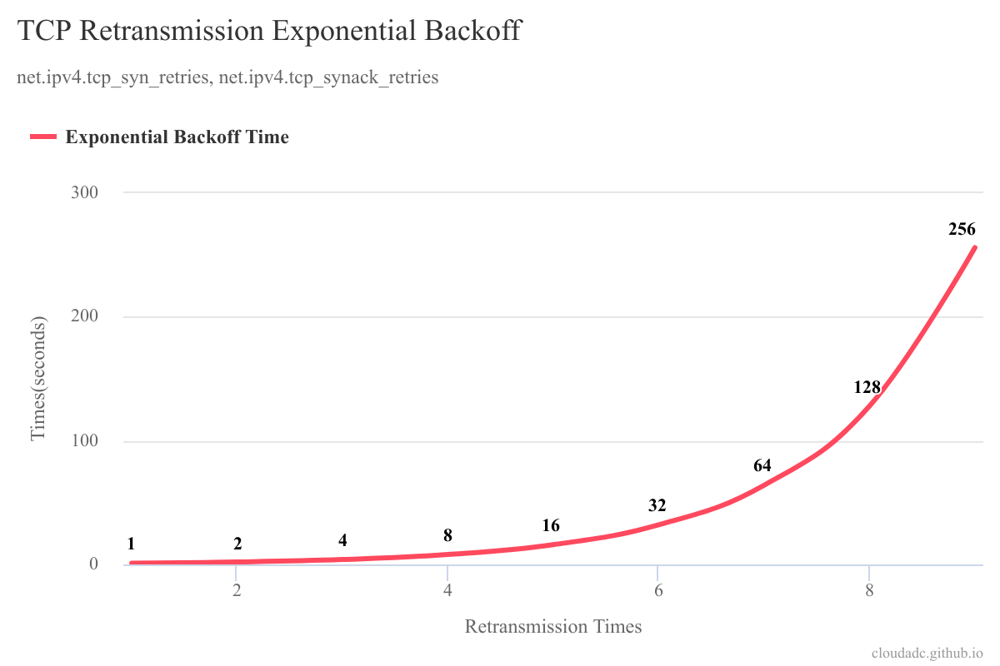  

The linux network stack also has a `net.ipv4.tcp_synack_retries` kernel parameter, the default value is 5, which means there should be 5 times SYN + ACK Retransmission in 31 seconds.

[source, bash]
----
# sysctl net.ipv4.tcp_synack_retries
net.ipv4.tcp_synack_retries = 5
----

Cause the SYN Retransmission will trigger SYN + ACK Retransmission time reset, so to investigate how many times SYN + ACK Retransmission, we need enlarge the SYN retries in trans side via

[source, bash]
----
sysctl -w net.ipv4.tcp_syn_retries=9
----

this will make the time interval between 6th retry and 7th retry are 32 seconds, the time interval between 7th retry and 8th retry are 64 seconds, which has enough time to view SYN + ACK retransmission. Once set the SYN retries to 9, re-run the recv and trans, it will collect 40 packets with 5 times SYN + ACK Retransmission .

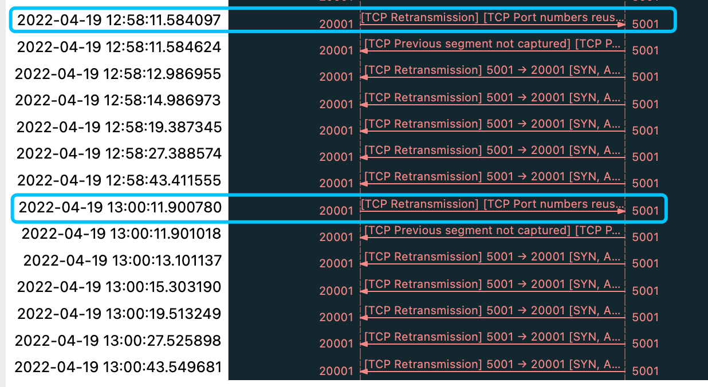

if use `tcp.flags.syn == 1 and tcp.flags.ack == 0` to filter the SYN send to recv by trans, there will be be 10 packets(1st SYN, and 9 times retries):

|===
|No |SYN Times |Retry SYN Times |Timestamp |Time Interval comapre last SYN Times(seconds)

|1
|1
|
|21:07:38.595
|

|3
|2
|1
|21:07:39.597
|1

|6
|3
|2
|21:07:41.600
|2

|9
|4
|3
|21:07:45.612
|4

|12
|5
|4
|21:07:53.629
|8

|15
|6
|5
|21:08:09.643
|16

|18
|7
|6
|21:08:41.708
|32

|20
|8
|7
|21:09:45.901
|64

|27
|9
|8
|21:11:46.221
|*120*

|34
|10
|9
|21:13:46:540
|*120*
|===

From the SYN + ACK Retransmission diagram, there 3 groups SYN + ACK Retransmission finished 5 times Retransmission:

1. between 7th retry SYN(8th SYN) and 8th retry SYN(9th SYN)
2. between 8th retry SYN(9th SYN) and 9th retry SYN(10th SYN)
3. after 9th retry SYN(10th SYN)

In conjunction table analysis with SYN Retransmission Exponential backoff:

* Time Interval between 8th retry and 7 th retry should be 128, but the table analysis data is 120
* Time Interval between 9th retry and 8 th retry should be 256, but the table analysis data is 120

That because another linux kernel parameter `kernel.hung_task_timeout_secs`, by default linux kernel will timeout any task that hang on 120 seconds, each retry be thought as a task in linux kernel.

[source, bash]
----
~]# sysctl kernel.hung_task_timeout_secs
kernel.hung_task_timeout_secs = 120
---- 

both `SYN Retransmission` and `SYN + ACK Retransmission` are complied with Exponential backoff formular, the relation of timeout and retries are:

[source, bash]
----
timeout = 2^n + 2^(n-1) + ... + 2^0
----

The relation between reties times and trans app timeout:

|===
|net.ipv4.tcp_syn_retries |timeout caculation

|6
|127 = (2^6 + 2^5 + 2^4 + 2^3 + 2^2 + 2^1 + 2^0)

|7
|247 = (120 + 2^6 + 2^5 + 2^4 + 2^3 + 2^2 + 2^1 + 2^0)

|8
|367 = (120 + 120 + 2^6 + 2^5 + 2^4 + 2^3 + 2^2 + 2^1 + 2^0)

|9
|587 = (120 + 120 + 120 + 2^6 + 2^5 + 2^4 + 2^3 + 2^2 + 2^1 + 2^0)
|===

With the `net.ipv4.tcp_syn_retries=9` the trans will run around 10 minutes to exit, with the default `net.ipv4.tcp_syn_retries=6`, the trans will run around 2 minutes timeout to exit. 

To analysis SYN + ACK Retransmission Exponential backoff times, extract the packet 28 - 33:

|===
|No |SYN + ACK Times |Retry SYN + ACK Times |Timestamp |Time Interval comapre last SYN + ACK Times(seconds)

|28
|1
|
|21:11:46.221
|

|29
|2
|1
|21:11:47.627
|1

|30
|3
|2
|21:11:49.630
|2

|31
|4
|3
|21:11:54.034
|4

|32
|5
|4
|21:12:02.043
|8

|33
|6
|5
|21:12:18.072
|16
|===

=== What's will behave if firewall reset SYN?

With the Linux TCP stack, if the timeout or retries occurred, the user space api will get a error(probably the usr space app need to handle error well). But if the client and server communication via a proxy, or firewall, the timeout or retries will end with a reset packet in most of occasion.

If set a policy on host `app-2` to REJECT any packet if destination port is `5001`,

[source, bash]
----
iptables -I INPUT -p tcp --dport 5001 -j REJECT --reject-with tcp-reset
----

than client will receive the RST packet from server.

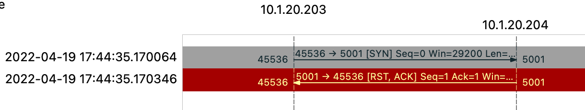

=== What's will behave if firewall reset SYN + ACK?

If set a policy on host `app-1` to REJECT any packet if destination port is `20001`,

[source, bash]
----
iptables -I INPUT -p tcp --dport 20001 -j REJECT --reject-with tcp-reset
----

then start the client on host `app-1` with setting a client port, connect to server on host `app-2`

[source, bash]
----
ttcp -t -P 20001 app-2
----

the will trigger TCP Retransmission 6 times due to linux network stack ipv4 setting.

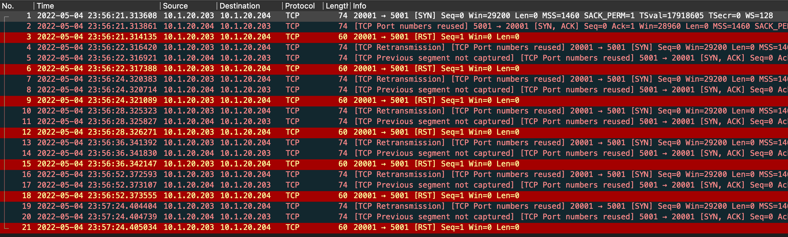

* Why reset not ending the tcp connection? 
** Because the Client TCP Stack not receive the `RST`, the client TCP stack wait the `SYN + ACK` from server and never receives, the `SYN + ACK` be reject by firewall and send `RST` to server.

* Why client retries 6 times?
** Because the client host `app-1` has setting retries times via `net.ipv4.tcp_syn_retries=6`.

* Why server didn't retransmission?
** Because the TCP Satck on server side received the `RST` packet.

* Why *TCP Port numbers reused*?
** Server port reused due to
** client port reused duo to retransmission.

* Why *TCP Previous segment not captured*?
** The Client not received `SYN + ACK`.  

=== What's will behave if proxy between trans and recv?

As below diagram, the host `lb-1` play as proxy, host `lb-2` as trans, host `app-1` play as recv.

[source, bash]
----
    lb-2    --->    lb-1    --->    app-1
----

*Setup proxy on host `lb-1 `*

* add DNAT rule to modify destination address to host `app-1`'s ip address.

[source, bash]
----
iptables -t nat -A PREROUTING -p tcp -i ens33 -d 10.1.10.201 -j DNAT --to-destination 10.1.20.203
----

* add SNAT rule to modify source address to host `lb-1`'s internal NIC referred address

[source, bash]
----
iptables -t nat -A POSTROUTING -o ens34 -j SNAT --to 10.1.20.201 
----

* enable packet forward on linux kernel network stack

[source, bash]
----
sysctl -w net.ipv4.ip_forward=1
----

*Setup recv on host `app-1`*

* Modify `/etc/ttcp.conf`, to disable silent mode

[source, bash]
----
silent=0
----

* Start the recv

[source, bash]
----
ttcp -r
----

*Setup trans on host `lb-2`*

* Modify `/etc/ttcp.conf`, to disable silent mode

[source, bash]
----
silent=0
----

* Start the trans

[source, bash]
----
ttcp -t 10.1.10.201
----

* Review the Three-Way Handshaking Packet sequence*

[source, bash]
----
    lb-2            lb-1            app-1

             1               2
    SYN     --->    SYN     --->    SYN

             4               3
SYN + ACK  <---  SYN + ACK  <---  SYN + ACK        

             5               6
    ACK     --->    ACK     --->    ACK
---- 

=== How packet be forwarded in outbound masquerading NAT scenario?

With masquerading, a system will forward packets that are not directly addressed to itself to the intended recipient, while changing the source address of the packets that go through to its own public IP address. When answers to those packets come in, the system will then modify the destination adress to the address of the original host, and send the packet on. This is usually used on the edge of a network to provide internet access to an internal network. Masquerading is a form of NAT(Network Address Translation).

Host `lb-1` play as outbound NAT device, external internet card is ens33, and external IP is 10.1.10.202(`lb-2`'s ip address, ttcp recv run on `lb-2`), 10.1.20.0/24 is internal network, host `app-1` has ttcp trans want to connect external ttcp recv run on `lb-2`.

As below diagram, the host `lb-1` play as outbound NAT device, host `lb-2` run ttcp recv as external internet service, host `app-1` play as ttcp trans.

[source, bash]
----
    app-1    --->    lb-1    --->    lb-2
----

*Setup masquerading NAT on lb-1*

* add MASQUERADE rule to specify source network and out NIC

[source, bash]
----
iptables -t nat -A POSTROUTING -o ens33 -s 10.1.20.0/24 -j MASQUERADE
----

* enable packet forward on linux kernel network stack

[source, bash]
----
sysctl -w net.ipv4.ip_forward=1
----

*Setup recv on host `lb-2`*

* Modify `/etc/ttcp.conf`, to disable silent mode

[source, bash]
----
silent=0
----

* Start the recv

[source, bash]
----
ttcp -r
----

*Setup trans on host `app-1`*

* Modify `/etc/ttcp.conf`, to disable silent mode

[source, bash]
----
silent=0
----

* To make the packet will be routed to NAT device than to external, add static route via update ens33's default gateway

[source, bash]
----
nmcli connection modify ens33 ipv4.dns 10.1.20.201
nmcli connection modify ens33 ipv4.gateway 10.1.20.201
nmcli connection down ens33 && nmcli connection up ens33 
----

* Start the trans

[source, bash]
----
ttcp -t -P 20010 10.1.10.202
----

* Review the Three-Way Handshaking Packet sequence*

[source, bash]
----
   app-1            lb-1            lb-2

             1               2
    SYN     --->    SYN     --->    SYN

             4               3
SYN + ACK  <---  SYN + ACK  <---  SYN + ACK

             5               6
    ACK     --->    ACK     --->    ACK
----

* Review the destination/source addr on each host

[source, bash]
----
 app-1                   lb-1                    lb-2

 D: 10.1.10.202:5001     D: 10.1.10.202:5001     D: 10.1.10.202:5001
 S: 10.1.20.203:20010    S: 10.1.10.201:20010    S: 10.1.10.201:20010
----

NOTE: MASQUERADE rule actually do s SNAT on NAT device, MASQUERADE rule equals to `iptables -t nat -A POSTROUTING -o ens33 -s 10.1.20.0/24 -j SNAT --to 10.1.10.201`.

=== How packet be forwarded in outbound port forwarding NAT scenario?

Port forwarding is another form of NAT in the edge that internal network to access external internet. With port forwarding, traffic to a single port is forwarded either to a different port on the same machine, or to a port on a different machine. This mechanism is typically used to "hide" a server behind another machine, or to provide access to a service on an alternate port.

To avoid the answers packets be send directly to original client, the port forwarding need masquerading configured.

Host `lb-1` as outbound NAT device, external internet card is ens33, and external IP is 10.1.10.202(`lb-2`'s ip address, ttcp recv run on), 10.1.20.0/24 is internal network, host `app-1` has ttcp trans want to connect external ttcp recv run on `lb-2`, as showing in below diagram.

[source, bash]
----
    app-1    --->    lb-1    --->    lb-2
----

*Setup port forwarding NAT on lb-1*

* add port forwarding E rule to specify source network and out NIC

[source, bash]
----
iptables -t nat -A PREROUTING -p tcp -i ens34 --dport 30050 -s 10.1.20.0/24 -j DNAT --to-destination 10.1.10.202:5001
iptables -t nat -A POSTROUTING -p tcp -o ens33 -s 10.1.20.0/24 -j MASQUERADE
----

* enable packet forward on linux kernel network stack

[source, bash]
----
sysctl -w net.ipv4.ip_forward=1
----

*Setup recv on host `lb-2`*

* Modify `/etc/ttcp.conf`, to disable silent mode

[source, bash]
----
silent=0
----

* Start the recv

[source, bash]
----
ttcp -r
----

*Setup trans on host `app-1`*

* Modify `/etc/ttcp.conf`, to disable silent mode

[source, bash]
----
silent=0
----

* To make the packet will be routed to NAT device than to external, add static route via update ens33's default gateway

[source, bash]
----
nmcli connection modify ens33 ipv4.dns 10.1.20.201
nmcli connection modify ens33 ipv4.gateway 10.1.20.201
nmcli connection down ens33 && nmcli connection up ens33
----

* Start the trans

[source, bash]
----
ttcp -t -P 20050 -p 30050 10.1.10.201
----

* Review the Three-Way Handshaking Packet sequence*

[source, bash]
----
   app-1            lb-1            lb-2

             1               2
    SYN     --->    SYN     --->    SYN

             4               3
SYN + ACK  <---  SYN + ACK  <---  SYN + ACK

             5               6
    ACK     --->    ACK     --->    ACK
----

* Review the destination/source addr on each host

[source, bash]
----
 app-1                      lb-1(ens34)            lb-1(ens33)                lb-2

 D: 10.1.10.201:30050       D: 10.1.10.201:30050   D: 10.1.10.202:5001        D: 10.1.10.202:5001
 S: 10.1.20.203:20050       S: 10.1.20.203:20050   S: 10.1.10.201:20050       S: 10.1.10.201:20050
----

=== How packet be forwarded in Load balancing scenario?

Load balancing will distribute connections to multiple hosts, multiple trans connections distribute to multiple recv hosts base on Load balancing algorithm.

As below diagram:

[source, bash]
----
                      ---> app-1    
 lb-2   --->  lb-1   
                      ---> app-2
----

* `lb-1` play as load balancer, will have a entry `10.1.10.201:5001`, ttcp trans's connection to this entry will goes into different members
* `app-1` play as member, which run ttcp recv
* `app-2` play as member, which run ttcp recv
* `lb-2` run ttcp trans

*Setup load balancing on lb-1*

* add load balancing rule 

[source, bash]
----
iptables -t nat -A PREROUTING -p tcp -d 10.1.10.201 --dport 5001 -m statistic --mode random --probability 0.5 -j DNAT --to-destination 10.1.20.203:5001
iptables -t nat -A PREROUTING -p tcp -d 10.1.10.201 --dport 5001 -j DNAT --to-destination 10.1.20.204:5001
iptables -t nat -A POSTROUTING -p tcp ! -s 10.1.20.0/24 -j MASQUERADE
----

Note that there are 2 different probabilities are defined and not 0.5 everywhere, the reason is that the rules are executed sequentially. With a probability of 0.5, the first rule will be executed 50% of the time and skipped 50% of the time, which means the skipped 50% will goes into second rule.

* enable packet forward on linux kernel network stack

[source, bash]
----
sysctl -w net.ipv4.ip_forward=1
----

*Setup revc on app-1/app-2*

* Start the recv

[source, bash]
----
ttcp -r
----

*Setup trans on host `lb-2`*

* Run the trans many times(use `-l` to specify a small buf, `-n` to specify only send one buf) 

[source, bash]
----
for i in {1..1000} ; do ttcp -t -l 1024 -n 1 10.1.10.201 ; done
----

* Review the iptables stats(2 members almost has the same connections)

image:img/iptables-lb-stats.png[]

*Packet forward sequence*

Packet forward sequence samiliar as proxy/nat mode.

== Data Transfer 

=== How to monitor TCP read/write buffer?

TCP is a connection-oriented protocol, which creates a virtual conection between sending process and receiving process; TCP also is a stream-oriented protocol, which allows the sending process to deliver data as a stream of bytes and allows the receiving process to obtain data as a stream of bytes.

Because the sending process and receiving process may not write or read data at the same speed, TCP needs buffers for storage, There are 2 buffers, the sending buffer and the receiving buffer, one for each direction. The buffer use a circular byte array as show in below figure. 

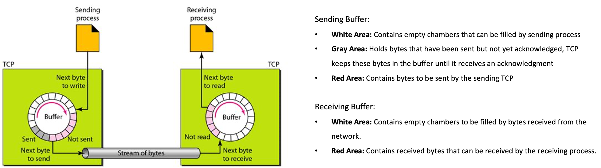

Linux kernel network stack has 2 parameters to define the TCP read/write buffer.

[source, bash]
.*net.ipv4.tcp_wmem*
----
~]# sysctl net.ipv4.tcp_wmem
net.ipv4.tcp_wmem = 4096	16384	4194304
----

`net.ipv4.tcp_wmem` parameter consists of 3 values, a minimum, default, and maximum.

* The minimum represents the smallest receive buffer size a newly created socket is entitled to as part of its creation. The minimum value defaults to 1 page or 4096 bytes.
* The default value represents the initial size of a TCP sockets receive buffer. This value supersedes `net.core.rmem_default` used by other protocols. It is typically set lower than `net.core.wmem_default`. The default value for this setting is 16K bytes.
* The maximum represents the largest receive buffer size for auto-tuned send buffers for TCP sockets. This value does not override `net.core.rmem_max`. The default value for this setting is somewhere between 64K bytes and 4M bytes based on the amount of memory available in the system.

[source, bash]
.*net.ipv4.tcp_rmem*
----
~]# sysctl net.ipv4.tcp_rmem
net.ipv4.tcp_rmem = 4096	87380	6291456
----

Contains three values that represent the minimum, default and maximum size of the TCP socket receive buffer.

* The minimum represents the smallest receive buffer size guaranteed, even under memory pressure. The minimum value defaults to 1 page or 4096 bytes.
* The default value represents the initial size of a TCP sockets receive buffer. This value supersedes `net.core.rmem_default` used by other protocols. The default value for this setting is 87380 bytes. 
* The maximum represents the largest receive buffer size automatically selected for TCP sockets. This value does not override net.core.rmem_max. The default value for this setting is somewhere between 87380 bytes and 6M bytes based on the amount of memory in the system.

[source, bash]
.*net.ipv4.tcp_moderate_rcvbuf*
----
~]# sysctl net.ipv4.tcp_moderate_rcvbuf
net.ipv4.tcp_moderate_rcvbuf = 1
----

By default, Linux kernel network stack enable TCP performs receive buffer auto-tuning, attempting to automatically size the buffer (no greater than tcp_rmem) to match the size required by the path for full throughput.

Monitoring the TCP buffer usage is pretty straight-forward; you can grab it from netstat -nt, in the 2nd and 3rd column, for receive and send respectively.

You may also want to monitor this by looking directly to /proc/net/tcp and /proc/net/udp, watching the 5th column; being the right-hand in the colon ( : ) the tx buffer queue; and the right-hand, the RX buffer.

Under a NIC level, we can't grab the real-time ring buffer usage. In some NICs we can watch for drops, using ethtool -S <NIC>, if the driver provides the info.

There's also a tool, named dropwatch, which monitors kernel-level drops. 

[source, bash]
.*Statr recv*
----
ttcp -r
----

[source, bash]
.*Start trans, to send 10 GB data to recv*
----
ttcp -t -n 10240 10.1.20.204
----

[source, bash]
.*Monitor buffer usage data via*
----
for i in {1..100} ; do netstat -nt | grep 5001 | awk '{print $2}'; sleep 1 ; done
for i in {1..100} ; do netstat -nt | grep 5001 | awk '{print $3}'; sleep 1 ; done
----

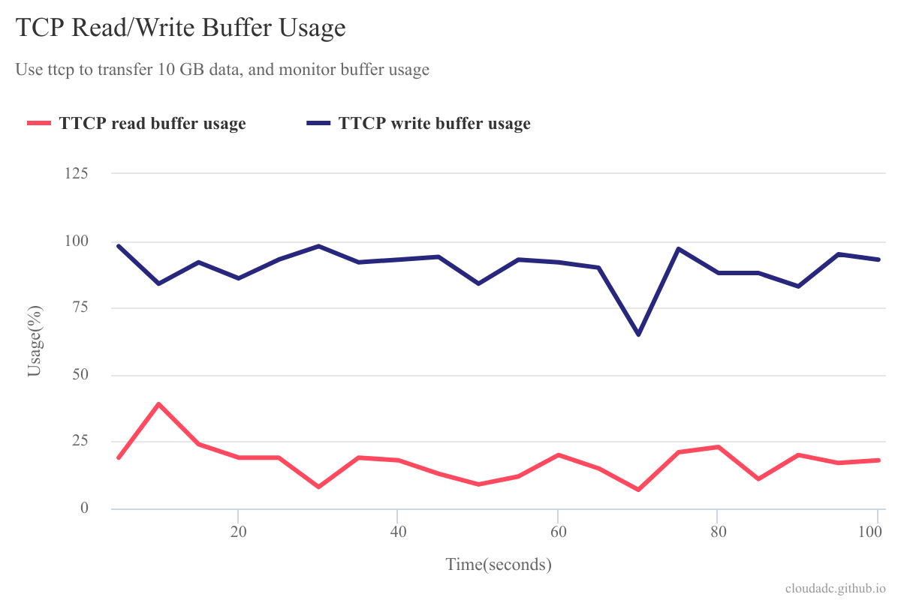

link:files/buffer-usage.txt[origin raw stats]

* Write buffer almost 100% used during 100 seconds monitor
* Read buffer usage keep in 20% during 100 seconds monitor
* The above testing base on linux default buffer size.

=== sequence number and acknowledgment number

[cols="5a,5a"]
|===
|sequence number |acknowledgment number

|

* The number of the first data byte contained in that segment
* A random number bewteen 0 and 2^32
* Control segment(connection establishment, termination, or abortion) also has a sequence number, but no data packet
* sequence number peered with acknowledgment number for Flow Control and Error Control

|

* The number of next byte that the receiver want to recive

|===

[source, bash]
.*Start the ttcp receiver*
----
ttcp -r -4 -v -p 12301 
----

[source, bash]
.*Start the ttcp transfer, sending 3 2 bytes sgement,*
----
# ttcp -t -v -4 -p 12301 -P 23401 10.1.20.203
ttcp-t: buflen=8192, nbuf=2048, align=16384/0, port=12301  tcp  -> 10.1.20.203
ttcp-t: socket
ttcp-t: connect
a
b
c
----

image:img/seq-ack.jpg[]

* Control segment: seq number is `2715613001`, and the ack number from receiver is `2715613002`
* 1st data segment: seq number is `1`, and the ack number from server is `3`
* 2nd data segment: seq number is `3`, and the ack number from receiver is `5`
* 3rd data segment: seq number is `5`, and the ack number from receiver is `7`

Use the ttcp to send 5 continue segments, each with size of 1000 bytes.

[source, bash]
.*Start the ttcp receiver*
----
ttcp -r -4 -v -p 12301 -l 1000 -n 5 -s
----

[source, bash]
.*Start the ttcp transfer*
----
ttcp -t -v -4 -p 12301 -P 23401 -l 1000 -n 5 -w 1000 -s 10.1.20.203
----

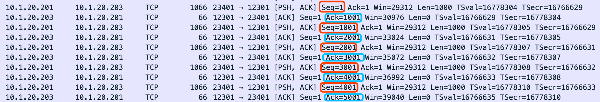

|===
|no |seq number |ack number

|1
|1
|1001

|2
|1001
|2001

|3
|2001
|3001

|4
|3001
|4001

|5
|4001
|5001
|===

=== How TCP recv buffer size affect packet processing

Send 10 MB size large message 50 times(total 500 MB in size), and record the time if taffic processed per seconds(TPS), run 3 times for each specific recv buffer size, and caculate the avarage TPS.

[source, bash]
----
ttcp -r -4 -l 10485760 -n 50 -p 10000 -s -b 21845 -v
ttcp -t -l 10485760 -n 50 -p 10000 -s  10.1.20.204
----

*  `-b` with recv side will set the recv buffer size
*  `-l 10485760` - single message size, 10 MB
*  `-n 50` - how many messages be sent, 50

|===
|SO_RCVBUF |KB/sec|KB/sec|KB/sec |AVG TPS(MB/sec)

|87380
|50773.00
|49461.45
|49192.62
|50

|43690
|47195.15
|46548.71
|46734.77
|47

|21845
|36026.04
|35583.06
|36256.20
|36

|10923
|24055.33
|23748.42
|23106.25
|24

|5460
|5144.34
|5159.72
|5148.27
|5.2

|2730
|3836.44
|-
|-
|3.8

|1365
|2390.78
|-
|-
|2.4

|===

=== How TCP send buffer size affect packet processing

Send 1 MB size large message 50 times(total 50 M in size), and record the time if taffic processed per seconds(TPS), run 3 times for each specific send buffer size, and caculate the avarage TPS.

[source, bash]
----
ttcp -r -4 -l 1048576 -n 50 -p 10000 -s -v
ttcp -t -l 1048576 -n 50 -p 10000 -s -b 16384 10.1.20.204
----

*  `-b` with recv side will set the recv buffer size
*  `-l 1048576` - single message size, 1 MB
*  `-n 50` - how many messages be sent, 50

|===
|SO_SNDBUF |KB/sec|KB/sec|KB/sec |AVG TPS(MB/sec)

|32768
|56403.51
|57073.74
|54878.68
|56

|16384
|50773.00
|49461.45
|49192.62
|50

|12288
|870.79
|757.07
|-
|0.8

|8192
|870.54
|606.97
|871.09
|0.8

|===

Conclusion fo snd/rcv buf to affect the tcp traffic:

* The default snd/rcv buf size(16384/87380) have well performance
* Decrease send buffer size affect tcp traffic significantly.

=== How MSS affect packet processing

MSS(maximum segment size) is a parameter of the options field of the TCP header that specifies the largest amount of data. 

----
MSS = MTU - 20 -20
----

MTU is the size of the largest protocol data unit (PDU) that can be communicated in a single network layer transaction. TCP has regular 20 bytes headers, and IP always has 20 bytes headers,

[source, bash] 
.*View default MTU*
----
# ifconfig ens33| grep mtu
ens33: flags=4163<UP,BROADCAST,RUNNING,MULTICAST>  mtu 1500
----

[source, bash]
.*Set MTP a value*
----
ifconfig ens33 mtu 1300
----

Traffic process per seconds:

|===
|MTU |MSS |KB/sec 

|1500
|1460
|51520.98

|1300
|1260
|3665.92 

|1100
|1060
|976.42

|900
|860
|712.74
|===

* Linux TCP stack optimize the traffic processing with default MTU 1500.

=== What's the Relationship between IP Datagram and TCP Segment Sizes?

Base on rfc879, the relationship between the value of the maximum IP datagram size and the maximum TCP segment size is obscure.  The problem is that both the IP header and the TCP header may vary in length. The TCP Maximum Segment Size option (MSS) is defined to specify the maximum number of data octets in a TCP segment exclusive of TCP (or IP) header.

To notify the data sender of the largest TCP segment it is possible to receive the calculation of the MSS value to send is:

[source, bash]
----
MSS = MTU - sizeof(TCPHDR) - sizeof(IPHDR)
----

On receipt of the MSS option the calculation of the size of segment that can be sent is:

[source, bash]
----
SndMaxSegSiz = MIN((MTU - sizeof(TCPHDR) - sizeof(IPHDR)), MSS)
----

If MTU use default 1500, size of TCP Header is 32, IP header is 20, so the MSS is 1460, the max send segment is 1448, the following is 1447 bytes data, append enter is equal the max send segment.

[source, text]
.*1447 lenth data*
----
0123456780123456780123456780123456780123456780123456780123456780123456780123456780123456780123456780123456780123456780123456780123456780123456780123456780123456780123456780123456780123456780123456780123456780123456780123456780123456780123456780123456780123456780123456780123456780123456780123456780123456780123456780123456780123456780123456780123456780123456780123456780123456780123456780123456780123456780123456780123456780123456780123456780123456780123456780123456780123456780123456780123456780123456780123456780123456780123456780123456780123456780123456780123456780123456780123456780123456780123456780123456780123456780123456780123456780123456780123456780123456780123456780123456780123456780123456780123456780123456780123456780123456780123456780123456780123456780123456780123456780123456780123456780123456780123456780123456780123456780123456780123456780123456780123456780123456780123456780123456780123456780123456780123456780123456780123456780123456780123456780123456780123456780123456780123456780123456780123456780123456780123456780123456780123456780123456780123456780123456780123456780123456780123456780123456780123456780123456780123456780123456780123456780123456780123456780123456780123456780123456780123456780123456780123456780123456780123456780123456780123456780123456780123456780123456780123456780123456780123456780123456780123456780123456780123456780123456780123456780123456780123456780123456780123456780123456780123456780123456780123456
----

While sending above data over ttcp, it will get the max send segment.

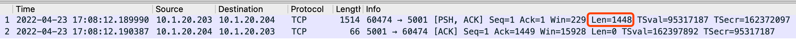

=== How timestamps affect the mss size?

There can be up to 40 bytes optional information in TCP Header, the TCP Timestamps options usually inserted as 3rd option in 8 bytes long, if TCP Timestamps is enabled, the 1st and 2nd option will set a NoP(No-Operation) options, each NoP option will take 2 bytes, so enable TCP Timestamps will take additional 12 bytes(2 + 2 + 8), this will make TCP headers as 32 bytes.

Run ttcp recv on host `app-2`, run ttcp trans on host `app-1`, specify to send only 1 message:

[source, bash]
----
ttcp -r
----

[source, bash]
----
ttcp -t 10.1.20.204
----

Note that, the above data transfer has TCP Timestamps enabled, use `tcpdump` capture a data transfer pcap.

Execute the below command on hosts that run ttcp:

[source, bash]
----
~]# sysctl -w net.ipv4.tcp_timestamps=0
net.ipv4.tcp_timestamps = 0
----

Then run ttcp recv on host `app-2`, ttcp trans on host `app-1`, specify to send only 1 message, this time will make data transfer has TCP Timestamps disabled, use `tcpdump` capture a data transfer pcap.

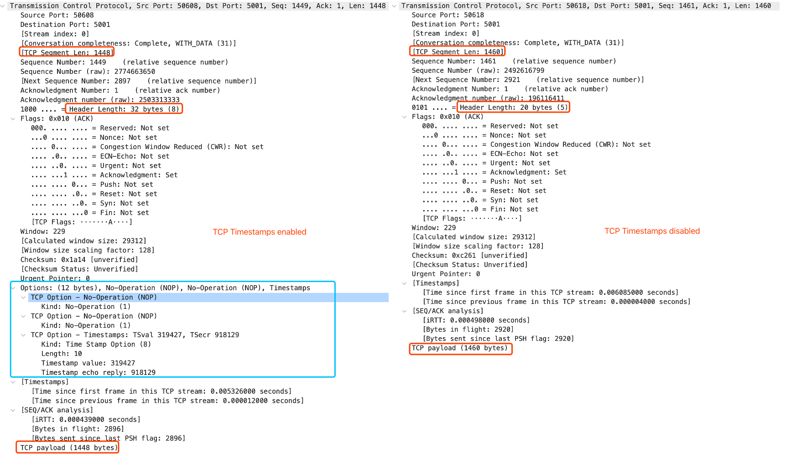

Turn timestamps off to reduce performance spikes related to timestamp generation. The sysctl command controls the values of TCP related entries, setting the timestamps kernel parameter found at `/proc/sys/net/ipv4/tcp_timestamps`.

Turn timestamps off with the following command:

[source, bash]
----
~]# sysctl -w net.ipv4.tcp_timestamps=0
net.ipv4.tcp_timestamps = 0
----

Turn timestamps on with the following command:

[source, bash]
----
~]# sysctl -w net.ipv4.tcp_timestamps=1
net.ipv4.tcp_timestamps = 1
----

Print the current value with the following command:

[source, bash]
----
~]# sysctl net.ipv4.tcp_timestamps
net.ipv4.tcp_timestamps = 1
----

The value 1 indicates that timestamps are on, the value 0 indicates they are off.

== F5 BIG-IP fastl4 profie

=== Reset on timeout

If set the reset-on-timeout to enable, and specify a idle timeout,

[source, bash]
----
reset-on-timeout enabled
idle-timeout 300
----

the system sends a reset packet (RST) when a connection exceeds the idle timeout value.

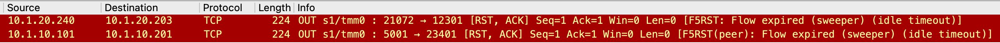

=== MSS Overwrite

If set mss-override enable and set a value,

[source, bash]
----
mss-override 256
----

than the Proxy will overwrite MSS(Maximum segment size), the smaller mss, the lower traffic processing capibility. The following are comparision between default MSS, and 256 bytes mss(send 3 MB data):

|===
|options |default(1460) |overwrite(256)

|Total Packets
|274
|849

|TPS (KB/sec)
|15678.19
|4855.24

|Time (seconds)
|0.20
|0.63

|CPU Time (seconds)
|0.04
|0.09
|===

The MSS is specified as a TCP option initially as TCP SYN packet.

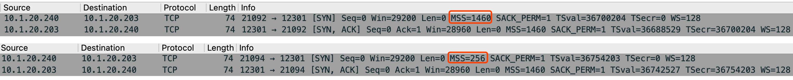

