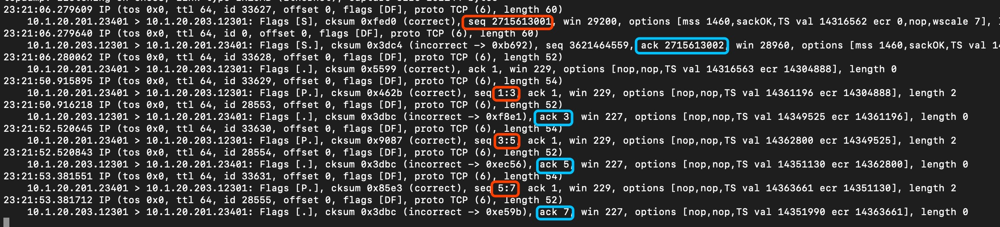
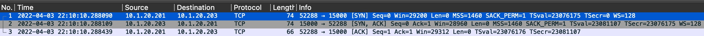

= User Guide
:toc: manual

== Installation

Install on Red Hat Linux via:

----
rpm -ivh l4-client-server-1.1-1.x86_64.rpm
----

== Run

=== ttcp

[source, bash]
.*Run as Receiver*
----
ttcp -r -s -4 -v -p 5050
----

[source, bash]
.*Run as Transfer*
----
ttcp -t -s -n 10240 -v -4 -p 5050 10.1.20.203
----

[source, bash]
.*Collect Results*
----
ttcp-r: 83886080 bytes in 1.34 real seconds = 61108.02 KB/sec +++
ttcp-r: 83886080 bytes in 0.10 CPU seconds = 827040.34 KB/cpu sec
ttcp-r: 10341 I/O calls, msec/call = 0.13, calls/sec = 7713.84
ttcp-r: 0.0user 0.0sys 0:01real 6% 0i+0d 330maxrss 0+2pf 368+0csw

ttcp-t: 83886080 bytes in 1.29 real seconds = 63287.18 KB/sec +++
ttcp-t: 83886080 bytes in 0.03 CPU seconds = 2522633.49 KB/cpu sec
ttcp-t: 10240 I/O calls, msec/call = 0.13, calls/sec = 7910.90
ttcp-t: 0.0user 0.0sys 0:01real 1% 0i+0d 362maxrss 0+2pf 122+0csw
----

=== echoS

=== chat

== Err codes

|===
|errno |description |note

|98
|Address already in use
|bind() failed due to address already in use

|99
|Cannot assign requested address
|bind() failed due to can not assign a port

|111
|Connection refused
|connect() failed due to incorrect port

|113
|No route to host
|connect() failed due to incorrect host

|===

== Basic Process

=== sequence number and acknowledgment number

[cols="5a,5a"]
|===
|sequence number |acknowledgment number

|

* The number of the first data byte contained in that segment
* A random number bewteen 0 and 2^32
* Control segment(connection establishment, termination, or abortion) also has a sequence number, but no data packet
* sequence number peered with acknowledgment number for Flow Control and Error Control

|

* The number of next byte that the receiver want to recive

|===

[source, bash]
.*Start the ttcp receiver*
----
ttcp -r -4 -v -p 12301 
----

[source, bash]
.*Start the ttcp transfer, sending 3 2 bytes sgement,*
----
# ttcp -t -v -4 -p 12301 -P 23401 10.1.20.203
ttcp-t: buflen=8192, nbuf=2048, align=16384/0, port=12301  tcp  -> 10.1.20.203
ttcp-t: socket
ttcp-t: connect
a
b
c
----

* Control segment: seq number is `2715613001`, and the ack number from receiver is `2715613002`
* 1st data segment: seq number is `1`, and the ack number from server is `3`
* 2nd data segment: seq number is `3`, and the ack number from receiver is `5`
* 3rd data segment: seq number is `5`, and the ack number from receiver is `7`

=== Three Times Handshake

Each time client connect to server will process a 3 times handshake:

[source, bash]
----
17:30:55.883856 IP chat-client.42620 > chat-server.8878: Flags [S], seq 4044800396, win 29200, options [mss 1460,sackOK,TS val 4294944614 ecr 0,nop,wscale 7], length 0
17:30:55.883882 IP chat-server.8878 > chat-client.42620: Flags [S.], seq 1228695765, ack 4044800397, win 28960, options [mss 1460,sackOK,TS val 550297 ecr 4294944614,nop,wscale 7], length 0
17:30:55.884311 IP chat-client.42620 > chat-server.8878: Flags [.], ack 1, win 229, options [nop,nop,TS val 4294944615 ecr 550297], length 0
----

=== Four Times Handshake

The client send 'exit' signal to server will simulate a *Active Close*, accordingly the server send 'exit' signal to client will simulate a *Passive Close*.

[source, bash]
.*Active Close*
----
17:31:31.908950 IP chat-client.42620 > chat-server.8878: Flags [F.], seq 81, ack 1, win 229, options [nop,nop,TS val 13331 ecr 584320], length 0
17:31:31.949050 IP chat-server.8878 > chat-client.42620: Flags [.], ack 82, win 227, options [nop,nop,TS val 586362 ecr 13331], length 0
17:31:33.909179 IP chat-server.8878 > chat-client.42620: Flags [F.], seq 1, ack 82, win 227, options [nop,nop,TS val 588322 ecr 13331], length 0
17:31:33.910129 IP chat-client.42620 > chat-server.8878: Flags [.], ack 2, win 229, options [nop,nop,TS val 15332 ecr 588322], length 0
----

[source, bash]
.*Passive Close*
----
17:33:21.541507 IP chat-server.8878 > chat-client.42622: Flags [F.], seq 81, ack 81, win 227, options [nop,nop,TS val 695954 ecr 120954], length 0
17:33:21.582513 IP chat-client.42622 > chat-server.8878: Flags [.], ack 82, win 229, options [nop,nop,TS val 122995 ecr 695954], length 0
17:33:23.542677 IP chat-client.42622 > chat-server.8878: Flags [F.], seq 81, ack 82, win 229, options [nop,nop,TS val 124954 ecr 695954], length 0
17:33:23.542703 IP chat-server.8878 > chat-client.42622: Flags [.], ack 82, win 227, options [nop,nop,TS val 697955 ecr 124954], length 0
----

