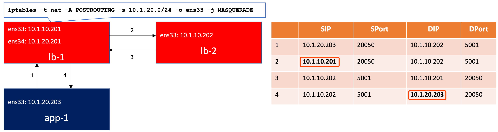
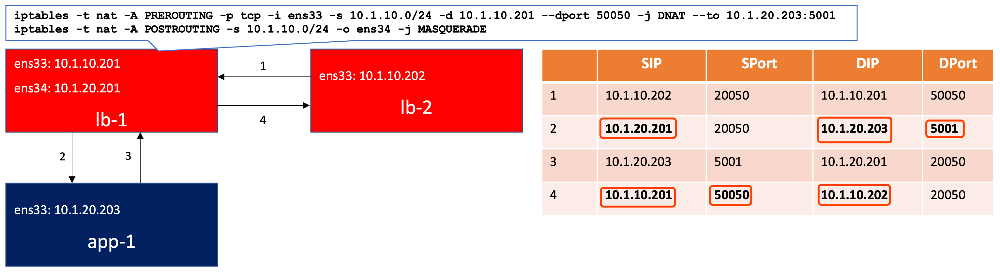
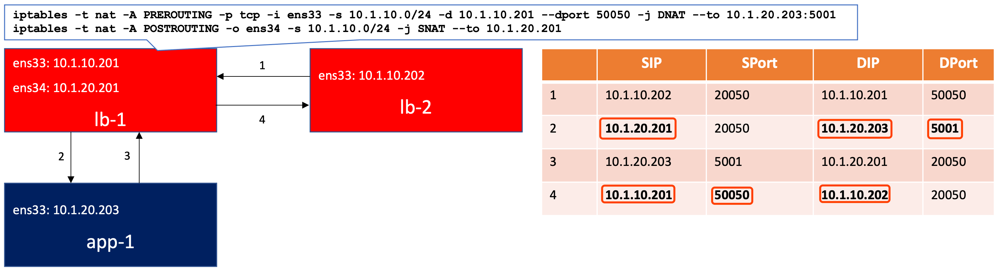

= netfilter
:toc: manual

== About netfilter kernel module

The Linux kernel has the built-in ability to filter packets, allowing some of them to be received by or pass through the system while stopping others. The kernel's netfilter has three built-in tables or rules lists. They are as follows:

.*netfilter built-in tables*
|===
|Table |Description

|filter
|The default table for handling network packets.

|nat
|Used to alter packets that create a new connection and used for Network Address Translation (NAT).

|mangle 
|Used for specific types of packet alteration.
|===

Each table has a group of built-in chains which correspond to the actions performed on the packet by the netfilter.

.*netfilter built-chains*
[cols="2,5a"]
|===
|Table |Chains

|filter
|

* INPUT — Applies to network packets that are targeted for the host.
* OUTPUT — Applies to locally-generated network packets.
* FORWARD — Applies to network packets routed through the host.

|nat
|

* PREROUTING — Alters network packets when they arrive.
* INPUT - 
* OUTPUT — Alters locally-generated network packets before they are sent out.
* POSTROUTING — Alters network packets before they are sent out.

|mangle
|

* INPUT — Alters network packets targeted for the host.
* OUTPUT — Alters locally-generated network packets before they are sent out.
* FORWARD — Alters network packets routed through the host.
* PREROUTING — Alters incoming network packets before they are routed.
* POSTROUTING — Alters network packets before they are sent out.

|===

== Kubernetes with netfilter

Kubernetes heavily depend on netfilter, below is a sample for simulate Kubernetes ClusterIP service.

[source, bash]
.*Creation*
----
iptables -t nat -N TTCP-SERVICES
iptables -t nat -A PREROUTING -j TTCP-SERVICES

iptables -t nat -N TTCP-MARK-MASQ
iptables -t nat -A TTCP-MARK-MASQ -j MARK --or-mark 0x4000

iptables -t nat -N TTCP-SVC-VS
iptables -t nat -A TTCP-SERVICES -p tcp --dport 5001 -d 10.1.10.201 -j TTCP-SVC-VS 
iptables -t nat -A TTCP-SVC-VS -p tcp --dport 5001 -d 10.1.10.201 ! -s 10.1.20.0/24 -j TTCP-MARK-MASQ 

iptables -t nat -N TTCP-SEP-01
iptables -t nat -A TTCP-SEP-01 -s 10.1.20.203 -j TTCP-MARK-MASQ 
iptables -t nat -A TTCP-SEP-01 -p tcp -j DNAT --to-destination 10.1.20.203:5001

iptables -t nat -N TTCP-SEP-02
iptables -t nat -A TTCP-SEP-02 -s 10.1.20.204 -j TTCP-MARK-MASQ 
iptables -t nat -A TTCP-SEP-02 -p tcp -j DNAT --to-destination 10.1.20.204:5001

iptables -t nat -A TTCP-SVC-VS -j TTCP-SEP-01 -m statistic --mode random --probability 0.5
iptables -t nat -A TTCP-SVC-VS -j TTCP-SEP-02

iptables -t nat -A OUTPUT -j TTCP-SERVICES

iptables -t nat -N TTCP-POSTROUTING
iptables -t nat -A POSTROUTING -j TTCP-POSTROUTING

iptables -t nat -A TTCP-POSTROUTING -j RETURN
iptables -t nat -A TTCP-POSTROUTING -j MARK --xor-mark 0x4000
iptables -t nat -A TTCP-POSTROUTING -j MASQUERADE
----

[source, bash]
.*Deletion*
----
iptables -t nat -D PREROUTING 1
iptables -t nat -D OUTPUT 1
iptables -t nat -D POSTROUTING 1

iptables -t nat -D TTCP-SERVICES 1
iptables -t nat -X TTCP-SERVICES

iptables -t nat -D TTCP-SVC-VS 3
iptables -t nat -D TTCP-SVC-VS 2
iptables -t nat -D TTCP-SVC-VS 1
iptables -t nat -X TTCP-SVC-VS

iptables -t nat -D TTCP-SEP-01 2
iptables -t nat -D TTCP-SEP-01 1
iptables -t nat -X TTCP-SEP-01

iptables -t nat -D TTCP-SEP-02 2
iptables -t nat -D TTCP-SEP-02 1
iptables -t nat -X TTCP-SEP-02

iptables -t nat -D TTCP-MARK-MASQ 1
iptables -t nat -X TTCP-MARK-MASQ

iptables -t nat -D TTCP-POSTROUTING 2
iptables -t nat -D TTCP-POSTROUTING 1
iptables -t nat -X TTCP-POSTROUTING 
----

== NAT

=== Concepts

*Three scenarios of NAT*

* *Outbond to internet* - you has single public IP address from your ISP vendor, but you have bunch of servers that need to connect to internet, only replies to packets with this IP address as source address  will return to you.
* *Multiple Servers* - you use one IP address to access multiple servers, Sometimes you want to change where packets heading into your network will go. Frequently this is because (as above), you have only one IP address, but you want people to be able to get into the boxes behind the one with the `real' IP address. If you rewrite the destination of incoming packets, you can manage this. This type of NAT was called port-forwarding under previous versions of Linux.
* *Transparent Proxying* - Sometimes you want to pretend that each packet which passes through your Linux box is destined for a program on the Linux box itself. This is used to make transparent proxies: a proxy is a program which stands between your network and the outside world, shuffling communication between the two. The transparent part is because your network won't even know it's talking to a proxy, unless of course, the proxy doesn't work.
  
*Two types of NAT*

* *Source NAT (SNAT)* - alter the source address of the first packet.
* *Destination NAT (DNAT)* - alter the destination address of the first packet

=== MASQUERADE

If the public IP address is dynamically allocated, then MASQUERADE can be used.

[source, bash]
----
iptables -t nat -A POSTROUTING -s 10.1.20.0/24 -o ens33 -j MASQUERADE
----

10.1.10.202 as internet service, 10.1.10.201 as gateway, 10.1.20.203 as internel client.

NOTE: MASQUERADE is used while public IP address is dynamically allocated, in this scenario, 10.1.10.201 is dynamically allocated.

=== SNAT

If the public IP address is mannually assigned, then the SNAT could be use to supply same ability like MASQUERADE.

[source, bash]
----
iptables -t nat -A POSTROUTING -o ens33 -s 10.1.20.0/24 -j SNAT --to 10.1.10.201
----

image:img/iptables-SNAT.png[]

=== DNAT + MASQUERADE 

Gateway hidden the server, 10.1.10.202 as a client to access the hidden server via 10.1.10.201 exposed endpoint 10.1.10.201:50050.

[source, bash]
----
iptables -t nat -A PREROUTING -p tcp -i ens33 -s 10.1.10.0/24 -d 10.1.10.201 --dport 50050 -j DNAT --to 10.1.20.203:5001
iptables -t nat -A POSTROUTING -s 10.1.10.0/24 -o ens34 -j MASQUERADE
----

=== DNAT + SNAT

Gateway hidden the server, the intranet gateway IP address is assigned manually, 10.1.10.202 as a client to access the hidden server via 10.1.10.201 exposed endpoint 10.1.10.201:50050.

[source, bash]
----
iptables -t nat -A PREROUTING -p tcp -i ens33 -s 10.1.10.0/24 -d 10.1.10.201 --dport 50050 -j DNAT --to 10.1.20.203:5001
iptables -t nat -A POSTROUTING -o ens34 -s 10.1.10.0/24 -j SNAT --to 10.1.20.201
----

